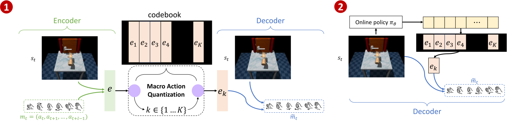
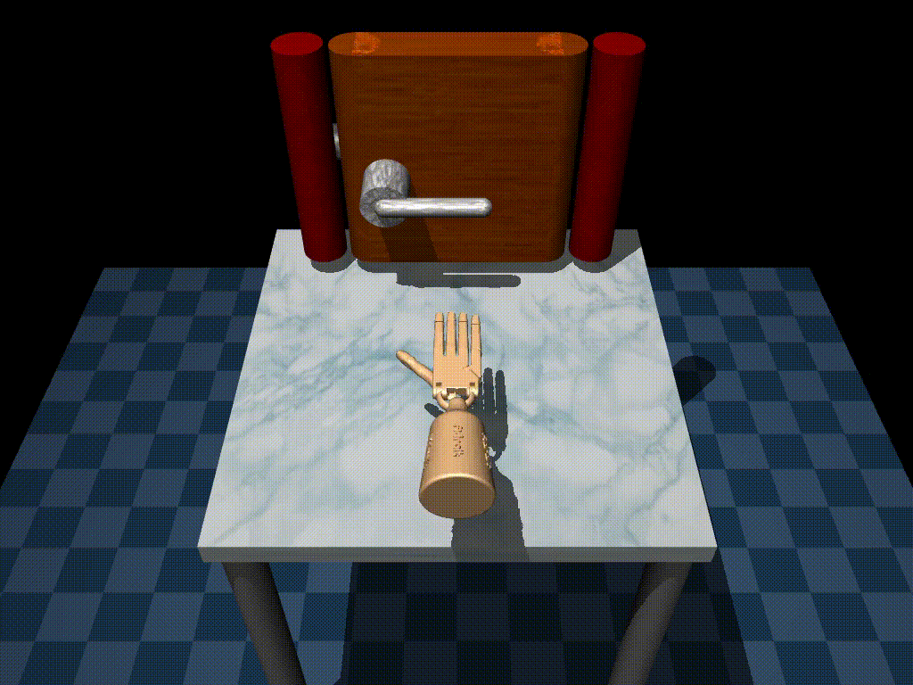

# Learning Human-Like RL Agents Through Trajectory Optimization With Action Quantization

This is the official repository of the NeurIPS 2025 paper [Learning Human-Like RL Agents Through Trajectory Optimization With Action Quantization](https://rlg.iis.sinica.edu.tw/papers/MAQ/).

If you use this work for research, please consider citing our paper as follows:
```
@inproceedings{
  guo2025learning,  
  title={Learning Human-Like RL Agents Through Trajectory Optimization With Action Quantization},
  author={Jian-Ting Guo, Yu-Cheng Chen, Ping-Chun Hsieh, Kuo-Hao Ho, Po-Wei Huang, Ti-Rong Wu, I-Chen Wu},
  booktitle={Thirty-ninth Conference on Neural Information Processing Systems},
  year={2025},
  url={https://openreview.net/forum?id=1A4Nlibwl5}
}
```



We propose a human‑likeness‑aware framework called Macro Action Quantization (MAQ), which consists of two components: (1) Human behavior distillation and (2) Reinforcement learning with Macro Actions.

The following instructions are prepared for reproducing the main experiments in the paper.


## Human-like Reinforcement Learning 
<!-- // show the door task and hammer task, with and without MAQ in RLPD
// in the door task mention that RLPD using back hand to open the door and MAQ+RLPD (our method) using a human like way to open the door 
// in the hammer task mention that RLPD due to its the reward-drvien RL agent, they maximize the reward by hammering the nail faster leading not human like behaviors -->

Human-like reinforcement learning remains underexplored in the RL community. Most research focuses on designing reward-driven agents; only a few studies investigate human-like RL that seeks both human-like behavior and optimal performance. However, most of these methods rely on pre‑defined behavior constraints or rule‑based penalties, requiring substantial effort for hand‑crafted design.
### Door Task
| MAQ+RLPD (Ours) | RLPD |
|:---:|:---:|
|  |  |
| **Human-like RL** <br> Opens the door naturally. | **Reward-driven RL** <br> Uses an unnatural "backhand" strategy to open the door, maximizing reward but sacrificing naturalness. |
### Hammer Task
| MAQ+RLPD (Ours) | RLPD |
|:---:|:---:|
|  |  |
| **Human-like RL** <br> Performs smoothly, striking the nail multiple times with controlled precision. | **Reward-driven RL** <br> Hammers aggressively fast to maximize reward, resulting in unnatural behavior. |

## Training Macro Action Quantization

### Prerequisites

The program requires a Linux platform with at least one NVIDIA GPU to operate.
For training RLPD, the CUDA version must be newer than 12.0.

### Build Programs

Clone this repository with the required submodules:
```bash
git clone --recursive https://github.com/rlglab/maq.git

cd MAQ
```

Enter the container to continue the instructions:
```bash
# start the container
./scripts/start-container.sh
```

> [!NOTE]
> All the instructions must be executed in the container.

### (Optional) Preprocessing Training and Testing Datasets
<!-- // the dataset must store in the offline_data and can use ./offline_data/gen_offline_data.py to generate the dataset provided by d4rl
// tell them the dataset format, and if using the customize dataset must change to that format -->


> [!NOTE]
> This section is optional. If you are using a customized dataset, please review this section. If you are using the default dataset, you can skip this.

The datasets used for training and testing must be saved as `.pkl` files in the `offline_data/` folder, and must have the same format as the following:
```python
[
    { # Trajectory 1
        'observations': np.array([...]),      # Shape: (T, obs_dim)
        'actions': np.array([...]),           # Shape: (T, action_dim)
        'rewards': np.array([...]),           # Shape: (T, )
        'next_observations': np.array([...]), # Shape: (T, obs_dim)
        'terminals': np.array([...])          # Shape: (T, )
    },
    ... # Trajectory 2
]
# T is the trajectory length, obs_dim is the observation dimension, action_dim is the action dimension
```
For verification, you can run:
```bash
python3 offline_data/check_dataset_format.py --dataset_path "your_dataset.pkl"
```
If the dataset is valid, it will print "is legal"; otherwise, it will print "illegal: error_message".


### Train Macro Action Quantization Methods
To reproduce the results in the paper, please run:
```bash
# For MAQ based methods
# Section 5.2.2: MAQ+RLPD in door task (with macro action length=9 and codebook size=16)
./scripts/train.sh --method "MAQ+RLPD" --sequence_length 9 --codebook_size 16 --environment "door-human-v1" --seed 1

# Section 5.2.2: MAQ+IQL in door task (with macro action length=9 and codebook size=16)
./scripts/train.sh --method "MAQ+IQL" --sequence_length 9 --codebook_size 16 --environment "door-human-v1" --seed 1

# Section 5.2.2: MAQ+DSAC in door task (with macro action length=8 and codebook size=8)
./scripts/train.sh --method "MAQ+DSAC" --sequence_length 8 --codebook_size 8 --environment "door-human-v1" --seed 1

# For baseline methods
# Section 5.2.2: SAC in door task
./scripts/train.sh --method "SAC" --environment "door-human-v1" --seed 1

# Section 5.2.2: RLPD in door task
./scripts/train.sh --method "RLPD" --environment "door-human-v1" --seed 1

# Section 5.2.2: IQL in door task
./scripts/train.sh --method "IQL" --environment "door-human-v1" --seed 1
```

For detailed parameters, please refer to the following table:

| Parameter | Flag | Description | Default |
| :--- | :--- | :--- | :--- |
| **Method** | `--method` | Training method (MAQ+RLPD, MAQ+IQL, MAQ+DSAC, SAC, RLPD, IQL) | `MAQ+RLPD` |
| **Environment** | `-env`, `--environment` | D4RL environment name (e.g., door-human-v1, hammer-human-v1, pen-human-v1, relocate-human-v1) | `door-human-v1` |
| **Sequence Length** | `-seqlen`, `--sequence_length` | Macro action length | `9`|
| **Codebook Size** | `-cbsz`, `--codebook_size` | VQ-VAE codebook size | `16`|
| **Seed** | `-s`, `--seed` | Random seed | `1`|
| **Training Source** | `-trs`, `--training_source` | Training dataset path (relative to `offline_data/`) | `""` (Defaults to environment dataset provided by D4RL)|
| **Testing Source** | `-tes`, `--testing_source` | Testing dataset path (relative to `offline_data/`) | `""` (Defaults to environment dataset provided by D4RL)|
| **Tag** | `-t`, `--tag` | Tag for the experiment (e.g., date) | `""`|
| **Auto Evaluate** | `--auto_evaluate` | Automatically evaluate the trained model after training | `False`|

### Training Results
This section introduces the files generated by different training methods. 

#### MAQ+RLPD and MAQ+DSAC
For example, the following command demonstrates training MAQ+RLPD with macro action length=9 and codebook size=16 on door task:
```
./scripts/train.sh --method "MAQ+RLPD" --sequence_length 9 --codebook_size 16 --environment "door-human-v1" --seed 1
```
You will obtain a folder:

```
RLPD_MAQ
└── log/
    └── exp_seed1_sq9_k16/
        └── door-human-v1/
            └── RLPDMAQ/
                ├── config.json
                ├── events.out.tfevents.*
                ├── experiment_data.csv
                └── model_<episode>_<normalized reward>.pth
```

If you also train MAQ+DSAC with the same environment, seed, sequence length and codebook size:
```
./scripts/train.sh --method "MAQ+DSAC" --sequence_length 9 --codebook_size 16 --environment "door-human-v1" --seed 1
```
You will obtain another folder in the same parent path:
```
DSAC_MAQ
└── log/
    └── exp_seed1_sq9_k16/
        └── door-human-v1/
            ├── RLPDMAQ/
            └── DSACMAQ/
                ├── config.json
                ├── events.out.tfevents.*
                ├── experiment_data.csv
                └── model_<episode>_<normalized reward>.pth
```

#### MAQ+IQL and IQL
We implemented IQL and MAQ+IQL based on the [IQL-PyTorch](https://github.com/gwthomas/IQL-PyTorch).
If you are running MAQ+IQL methods, you will obtain a folder:
```
IQL
└── log/
    └── door-human-v1/
        └── MAQ_iqlseed1_sq9_k16_seed1/
            ├── checkpoint_<episode>.pt
            ├── config.yaml
            └── events.out.tfevents.*
            
```


#### SAC
We implemented SAC based on the [stable-baselines3](https://github.com/DLR-RM/stable-baselines3).
For example, the following command demonstrates training SAC on door task with seed 1:
```
./scripts/train.sh --method "SAC" --environment "door-human-v1" --seed 1
```
You will obtain a log folder under `SAC/`:

```
SAC
└── log/
    └── door-human-v1/
        └── SAC_seed1/
            ├── checkpoints.csv
            │   └── events.out.tfevents.*
            ├── SAC_<exp_number>
            │   └── events.out.tfevents.*
            └── SAC.csv
            
```

#### RLPD
We implemented RLPD based on [ikostrikov's repository `RLPD`](https://github.com/ikostrikov/rlpd).
We also made small changes to the dataset loading, making it compatible with the customized datasets.
Before training RLPD, you need to build the environment for training RLPD. You can refer to their instructions or run the following command on our container:
```bash
# in workspace/
pip install -r rlpd/requirements.txt 
pip install jax==0.4.14 jaxlib==0.4.14+cuda11.cudnn86 -f https://storage.googleapis.com/jax-releases/jax_cuda_releases.html
pip install optax
pip install flax
pip install git+https://github.com/ikostrikov/dmcgym.git
pip uninstall mujoco-py
export LD_LIBRARY_PATH=$LD_LIBRARY_PATH:/root/.mujoco/mjpro150/bin
pip install git+https://github.com/ikostrikov/dmcgym.git
```
For training RLPD with your datasets, you can use the following commands:
```bash
XLA_PYTHON_CLIENT_PREALLOCATE=false python train_finetuning.py --env_name=<your env> \
    --utd_ratio=20 \
    --start_training 10000 \
    --max_steps 1000000 \
    --config=configs/rlpd_config.py \
    --project_name=<project name store in the wandb> \
    --seed=<your seed> \
    --checkpoint_model=true \
    --log_dir=/workspace/rlpd/<your log> \
    --training_dataset=<your training dataset stored in the ./offline_data>
```

### Train Macro Action Quantization with Different Macro Action Length and Codebook Size
<!-- // lazy_rerun.sh things here
// user can change the combination of macro action length and codebook size and methods in lazy_rerun.sh -->


We also provide a simple command to run the experiment with a specific macro action length and codebook size, and method. You can use the following command:
```bash
./scripts/lazy_rerun.sh
```

> [!NOTE]
> This command will run all the combination of macro action length and codebook size and methods to reproduce the experiment in section 5.2.3, it may take several hours to finish all the combinations (108 experiments in total).

You can also customize the combination of macro action length and codebook size and methods in `lazy_rerun.sh`, by modifying the following variables:
```bash
ENVS=("door-human-v1" "pen-human-v1" "hammer-human-v1" "relocate-human-v1") # "door-human-v1" "pen-human-v1" "hammer-human-v1" "relocate-human-v1"
METHODS=("MAQ+RLPD") # "MAQ+DSAC" "MAQ+IQL"
SEQS=(1 2 3 4 5 6 7 8 9)
KS=(16) # 8 16 32
SEEDS=(1 10 100) # 1 10 100
```


## Evaluation
<!-- // introduce the evaluation_results
// introduce DTW/WD?  -->

### Evaluate Macro Action Quantization Methods and Baselines
<!-- // scripts/evaluate.sh things here -->
After training the agents, you can evaluate the methods by using the following command:
```bash
# For MAQ based methods
# Section 5.2.2: MAQ+RLPD in door task (with macro action length=9 and codebook size=16)
./scripts/evaluate.sh --method "MAQ+RLPD" --sequence_length 9 --codebook_size 16 --environment "door-human-v1" --seed 1

# Section 5.2.2: MAQ+IQL in door task (with macro action length=9 and codebook size=16)
./scripts/evaluate.sh --method "MAQ+IQL" --sequence_length 9 --codebook_size 16 --environment "door-human-v1" --seed 1

# Section 5.2.2: MAQ+DSAC in door task (with macro action length=8 and codebook size=8)
./scripts/evaluate.sh --method "MAQ+DSAC" --sequence_length 8 --codebook_size 8 --environment "door-human-v1" --seed 1

# For baseline methods
# Section 5.2.2: SAC in door task
./scripts/evaluate.sh --method "SAC" --environment "door-human-v1" --seed 1

# Section 5.2.2: IQL in door task
./scripts/evaluate.sh --method "IQL" --environment "door-human-v1" --seed 1

# Section 5.2.2: RLPD in door task
./scripts/evaluate.sh --method "RLPD" --environment "door-human-v1" --seed 1 --model_path "<your model path>"
```

For detailed parameters, please refer to the following table:

| Parameter | Flag | Description | Default |
| :--- | :--- | :--- | :--- |
| **Method** | `--method` | Evaluating method (MAQ+RLPD, MAQ+IQL, MAQ+DSAC, SAC, RLPD, IQL) | `MAQ+RLPD` |
| **Environment** | `-env`, `--environment` | D4RL environment name (e.g., door-human-v1, hammer-human-v1, pen-human-v1, relocate-human-v1) | `door-human-v1` |
| **Sequence Length** | `-seqlen`, `--sequence_length` | Macro action length | `9`|
| **Codebook Size** | `-cbsz`, `--codebook_size` | VQ-VAE codebook size | `16`|
| **Seed** | `-s`, `--seed` | Random seed | `1`|
| **Training Source** | `-trs`, `--training_source` | Training dataset path (relative to `offline_data/`) | `""` (Defaults to environment dataset provided by D4RL)|
| **Testing Source** | `-tes`, `--testing_source` | Testing dataset path (relative to `offline_data/`) | `""` (Defaults to environment dataset provided by D4RL)|
| **Tag** | `-t`, `--tag` | Tag for the experiment (e.g., date) | `""`|
| **Model Path** | `-path`, `--model_path` | The path of the model to be evaluated | `""`|


> [!NOTE]
> For evaluating RLPD, you need to specify the model path of the RLPD model to be evaluated. Other baseline methods are able to locate the model path automatically.

### Evaluation Results
After evaluating the methods, you can find the evaluation results in the `evaluation_results/` folder.
For example, after evaluating the agent on the door task, you will obtain:
```
evaluation_results/
└── agent_performance_door-human-v1.csv
```

The file contains a comprehensive list of metrics. Here is a detailed breakdown of the headers:

| Category | Header Keyword | Description |
| :--- | :--- | :--- |
| **Basic Info** | `agent_type` | The type of the agent (e.g., MAQ+RLPD, SAC). |
| | `env_id` | The name of the environment (e.g., door-human-v1). |
| | `eval_episodes` | Total number of episodes used for this evaluation run. |
| | `base_seed` | The starting seed used for evaluation. |
| | `model_path` | The file path of the model being evaluated. |
| | `horizon` / `default_horizon` | The maximum steps allowed per episode (custom vs default). |
| **Performance** | `normalized_score` | The D4RL normalized score (0-100), higher is better. |
| | `raw_reward` | The raw environment reward. |
| | `success_rate` | The fraction of episodes where the task was successfully completed (0.0 to 1.0). |
| | `early_termination_rate` | Fraction of episodes terminated early due to success. |
| | `length` | The duration (number of steps) of the episode. |
| **Human Similarity** | `dtw_state_dtw_mean` | **Dynamic Time Warping (State)**: Average distance between agent states and human states. Lower is more human-like. |
| | `dtw_action_dtw_mean` | **Dynamic Time Warping (Action)**: Average distance between agent actions and human actions. Lower is more human-like. |
| | `wasserstein_state_w2_dist` | **Wasserstein Distance (State)**: Distance between the distribution of agent states and human states. Lower is more human-like. |
| | `wasserstein_action_w2_dist` | **Wasserstein Distance (Action)**: Distance between the distribution of agent actions and human actions. Lower is more human-like. |
| | `min_dtw_...` | Minimum DTW distance found among the human reference trajectories. |

#### Metric Naming Convention
The headers follow a structured naming convention to give granular insights:
`[Condition]_[Metric Name]_[Statistic]`

**1. Conditions (Prefixes)**
*   **(No Prefix)**: Aggregated over **all** episodes.
*   `success_`: Aggregated only over **successful** episodes.
*   `non_success_`: Aggregated only over **failed** episodes.

**2. Statistics (Suffixes)**
*   `_mean` / `_agg_mean`: The average value.
*   `_std` / `_agg_std`: The standard deviation.
*   `_max`: The maximum value observed.
*   `_min`: The minimum value observed.
*   `_exceed_default_pct`: Percentage of episodes longer than the default horizon.

**Examples:**
*   `success_length_mean`: Average length of successful episodes.
*   `non_success_dtw_action_dtw_mean_max`: The maximum action DTW distance observed in any failed episode.
*   `normalized_score_mean`: Average normalized score across all episodes.
 
